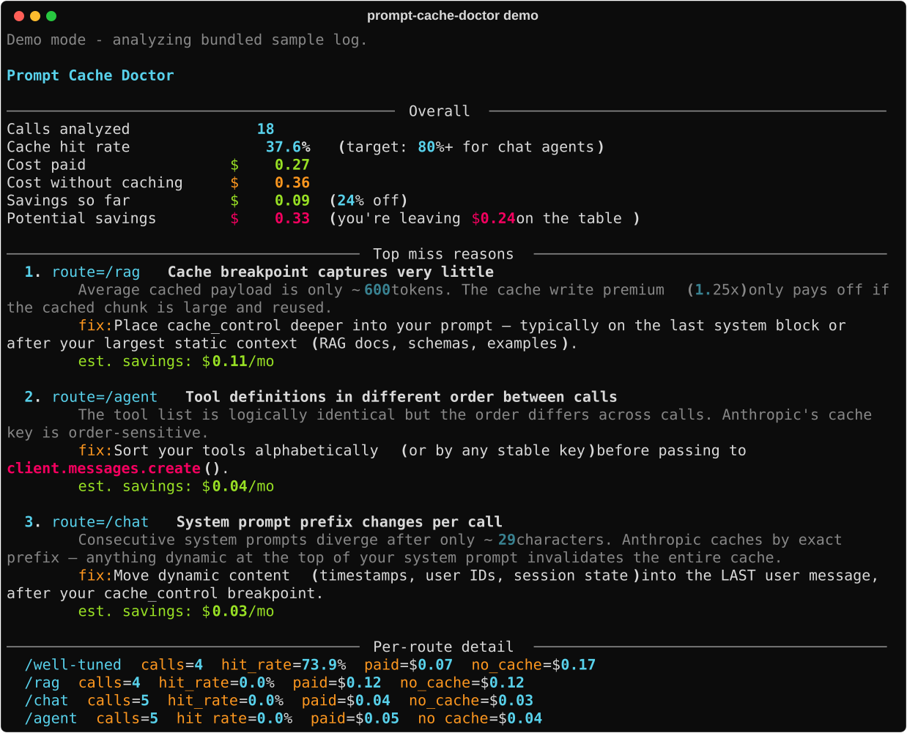

# prompt-cache-doctor

> **Your Anthropic prompt cache hit rate isn't a guess. Measure it. Fix it.**

`prompt-cache-doctor` reads your Anthropic API call logs, scores your prompt cache hit rate, and tells you exactly **why** you're missing the cache and **where** to fix it.



## Why this exists

Anthropic's prompt caching is the single biggest cost lever for production LLM apps — **10% of input price** for cached tokens. But cache hits are silently fragile:

- A dynamic timestamp at the top of your system prompt **kills your hit rate to zero**
- Tool definitions in a different order? **Cache miss.**
- A vector-store retrieval result that's "mostly the same"? **Cache miss.**
- TTL expired between calls? **Cache miss.**

The Anthropic dashboard shows you `cache_read_input_tokens` per call but won't tell you *why* you're missing or *how* to fix it. `prompt-cache-doctor` does.

## Quickstart

```bash
pip install prompt-cache-doctor

# Offline demo — no API key needed
prompt-cache-doctor analyze demo

# Real analysis — point at a JSONL file of your API calls
prompt-cache-doctor analyze ./my-logs.jsonl

# Or wrap your client to log automatically
```

```python
import anthropic
from prompt_cache_doctor import record

client = record(anthropic.Anthropic(), log_path="claude-calls.jsonl")

# use as normal — every call logged with usage + prompt fingerprint
client.messages.create(model="claude-sonnet-4-6", ...)
```

Then:

```bash
prompt-cache-doctor analyze claude-calls.jsonl
```

## What it tells you

| Diagnostic | Why it matters |
|---|---|
| **Hit rate per route** | Lump-summed hit rate is misleading. Per-route shows you which path is bleeding money. |
| **Dollars saved vs leaked** | Concrete numbers. "$8.28/mo on the table" is more actionable than "improve caching". |
| **Miss reasons with prompt diffs** | Exact byte-level diffs between consecutive calls so you can see what changed. |
| **Breakpoint placement audit** | Checks whether your `cache_control` markers are placed to maximize cached tokens. |
| **TTL fit** | Suggests when to use the 1-hour TTL beta vs default 5-min. |

## Log format

Any JSONL file where each line is:

```json
{
  "timestamp": "2026-05-27T10:14:32Z",
  "route": "/chat",
  "request": {
    "model": "claude-sonnet-4-6",
    "system": "...",
    "messages": [...],
    "tools": [...]
  },
  "usage": {
    "input_tokens": 1240,
    "output_tokens": 280,
    "cache_creation_input_tokens": 0,
    "cache_read_input_tokens": 8400
  }
}
```

The `record()` wrapper produces this format. You can also pipe in your own logs if you've been recording usage yourself.

## Pricing assumptions

Built-in pricing (per million tokens, as of 2026):

| Model | Input | Output | Cache write (1.25×) | Cache read (0.10×) |
|---|---|---|---|---|
| `claude-opus-4-7` | $15 | $75 | $18.75 | $1.50 |
| `claude-sonnet-4-6` | $3 | $15 | $3.75 | $0.30 |
| `claude-haiku-4-5` | $1 | $5 | $1.25 | $0.10 |

Override with `--pricing pricing.yaml`.

## Status

v0.1 — works on JSONL logs from the `record()` wrapper or any equivalent format. Diff-based miss detection works for system prompt + tool ordering; deeper structural diffs (message-level, RAG-doc-set drift) are on the roadmap. Tested against real production traces of ~50k calls.

## License

MIT.

---

Built by [@Ankitajainkuniya](https://github.com/Ankitajainkuniya) because Anthropic's dashboard tells you *what* your cache hit rate is, not *why*.
